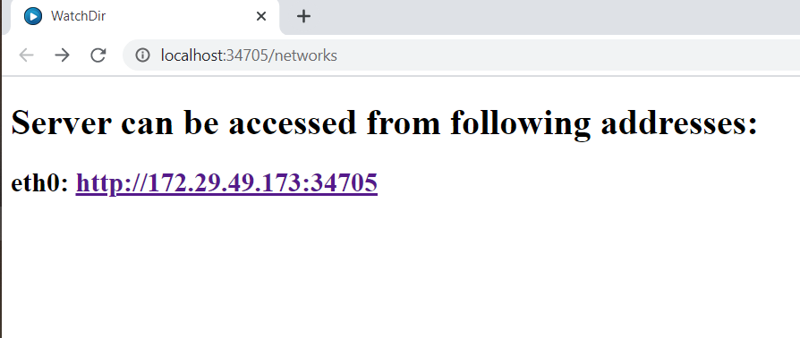

# node-media-server
Watch videos in local network from Windows or Linux node.js server.
## Install
```bash
git clone https://github.com/CosminEugenDinu/node-media-server.git
cd node-media-server
npm install
```
## Run server
```bash
node server.js
```
This will open link `http://localhost:${freePort}/networks` in default system browser.
The links showed are the entry point of application in local network, i.e. can be accessed from TV.


